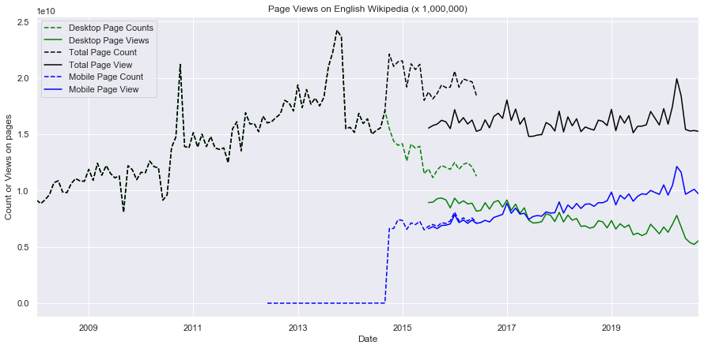

# data-512
## Assignment-1: Data Curation
For the purpose of the assignment we combine the data about Wikipedia page traffic from two different API's into a single dataset, perform some simple data processing steps on the data and analyze the data. The goal of this assignment is to construct, analyze, and publish a dataset of monthly traffic on English Wikipedia from January 1 2008 through August 30 2020. The purpose of the assignment is to familiarize one with the Jupyter Notebook environment for data collection to data analysis.

### Data Sources
The Wikipedia page traffic API is split into two seperate endpoints based on the date as:
1) **Legacy Pagecounts API** - [Documentation](https://wikitech.wikimedia.org/wiki/Analytics/AQS/Legacy_Pagecounts) and [Endpoints](https://wikimedia.org/api/rest_v1/#!/Pagecounts_data_(legacy)/get_metrics_legacy_pagecounts_aggregate_project_access_site_granularity_start_end) provides access to desktop and mobile traffic data from December 2007 through July 2016. <br />
  a) **API Method** - GET <br />
  b) **API Endpoint** - https://wikimedia.org/api/rest_v1/metrics/legacy/pagecounts/aggregate/{project}/{access-site}/{granularity}/{start}/{end} <br />

2) **Pageviews API** - [Documentation](https://wikitech.wikimedia.org/wiki/Analytics/AQS/Pageviews) and [Endpoints](https://wikimedia.org/api/rest_v1/#!/Pageviews_data/get_metrics_pageviews_aggregate_project_access_agent_granularity_start_end) provides access to desktop, mobile web, and mobile app traffic data from July 2015 through last month. <br />
  a) **API Method** - GET <br />
  b) **API Endpoint** - https://wikimedia.org/api/rest_v1/metrics/pageviews/aggregate/{project}/{access}/{agent}/{granularity}/{start}/{end} <br />

The documentations is available under [Creative Commons Attribution-ShareAlike License](https://creativecommons.org/licenses/by-sa/3.0/) <br />
See [Terms of Use](https://foundation.wikimedia.org/wiki/Terms_of_Use) for details.

### Folder Contents
```
.
├── README.md
├── data
│   ├── json
│       ├── pagecounts_desktop-site_200801-201607.json
│       ├── pagecounts_mobile-site_200801-201607.json
│       ├── pagecounts_all-access_200801-201607.json
│       ├── pageviews_all-access_201507-202009.json
│       ├── pageviews_mobile-app_201507-202009.json
│       ├── pageviews_mobile-web_201507-202009.json
│       └── pageviews_mobile-site_201507-202009.json
│   └── csv
│       ├── pagecounts_desktop-site_200801-201607.csv
│       ├── pagecounts_mobile-site_200801-201607.csv
│       ├── pagecounts_all-access_200801-201607.csv
│       ├── pageviews_all-access_201507-202009.csv
│       ├── pageviews_mobile-app_201507-202009.csv
│       ├── pageviews_mobile-web_201507-202009.csv
│       ├── pageviews_mobile-site_201507-202009.csv
│       └── en-wikipedia_traffic_200801-202009.csv
├── Assignment1.ipynb
└── english-wikipedia-views-2008-2020.jpg
```

### Consolidated Data Description
* **year** - Year(YYYY) of the page view
* **month** - Month(MM) of the page view
* **pagecount_all_views** (C) - Count of views on any page from any device in the date range 2008-01-01 to 2016-07-30
* **pagecount_desktop_views** (C) - Count of views on any page from desktop website in the date range 2008-01-01 to 2016-07-30
* **pagecount_mobile_views** (C) - Count of views on any page from either mobile website or mobile app in the date range 2008-01-01 to 2016-07-30
* **pageview_all_views** (V) - Count of views on any page from any device in the date range 2015-07-01 to 2020-09-30
* **pageview_desktop_views** (V) - Count of views on any page from desktop website in the date range 2015-07-01 to 2020-09-30
* **pageview_mobile_views** (V) - Count of views on any page from either mobile website or mobile app in the date range 2015-07-01 to 2020-09-30 <br />
(C) - column data source is Legacy Pagecounts API <br />
(V) - column data source is Pageviews API

### Requirements
For the purpose of fetching data, processing and analyzing it, we require the following:
1) [Python](https://www.python.org/downloads/) - Langauage used to program
2) [Anaconda](https://docs.anaconda.com/anaconda/install/) - Required to set up jupyter notebook 
2) [requests](https://requests.readthedocs.io/en/master/user/install/) - Enables python code to access the API using GET, POST, UPDATE or DELETE request
3) json - Enables python code to access the json object from the request and save it
4) csv - Enables python code to create CSV files for the different types of data
5) [pandas](https://pandas.pydata.org/docs/getting_started/install.html) - Enables python code to load data from csv files and perform necessary data processing
6) [matplotlib](https://matplotlib.org/users/installing.html) - Enables python code to create visualizations and graphs

### Steps to run
Follow the steps to successfully execute the jupyter notebook:
1) Download the folder **data-512-a1** or use git clone *repository url*
2) Unzip the folder if you have downloaded from github (no need to unzip if you have cloned the repository on your system)
3) Change directory to **data-512-a1** (cd data-512-a1)
4) Using Command Line on Windows or Terminal on Mac/Linux run the command **jupyter notebook** in the directory
5) The command will open a URL similar to ***http://localhost:8888/tree*** in your default browser (The port 8888 might change if it is already occupied)
6) You will be able to see all files of the folder **data-512-a1**
7) Double click on the file **Assignment1.ipynb** to open it
8) The jupyter notebook is up and running now
9) You can execute the notebook by running (Shift + Enter) each cell **sequentially**  or use **Kernel >> Restart & Run all**

### Methodology
#### Step 1: Data Collection

Data collection is done making multiple API requests to the required endpoints and storing the results in JSON/CSV output.

#### Step 2: Data Processing

For data collected from the Pageviews API, combine the monthly values for mobile-app and mobile-web to create a total mobile traffic count for each month.
After that we seperate the value of timestamp into four-digit year (YYYY) and two-digit month (MM) and discard values for day and hour (DDHH). Combine the different dataframes from the all request to get the final datafrae with the schema specified above

#### Step 3: Data Analysis

Plot a timeseries graph from January 1 2008 to September 30 2020 for different access methods (all device, mobile and desktop)



### Additional Details
* There is an overlap of about 1 year in the data from both the API's <br />
* The Pagecounts Wikipedia API gives the count for all kinds of agent (including users, crawlers, bots etc) <br />
* The Pageviews Wikipedia API gives the count for all kinds of agent (including users, crawlers, bots etc) but we are gathering data for **users only** <br />
